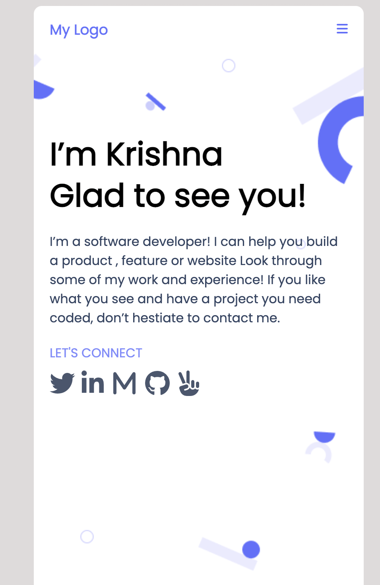
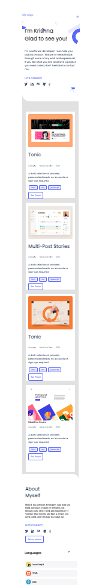
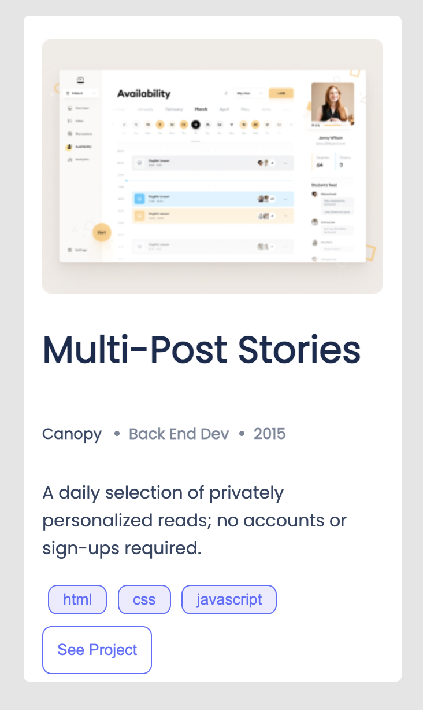
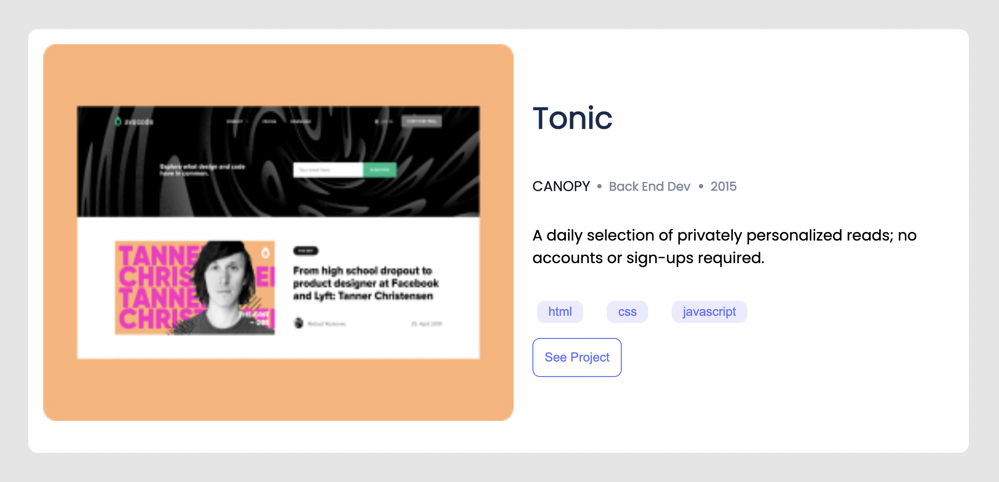
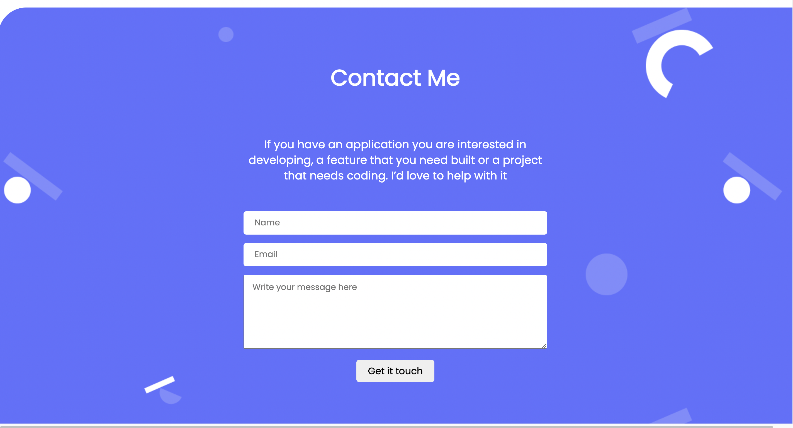
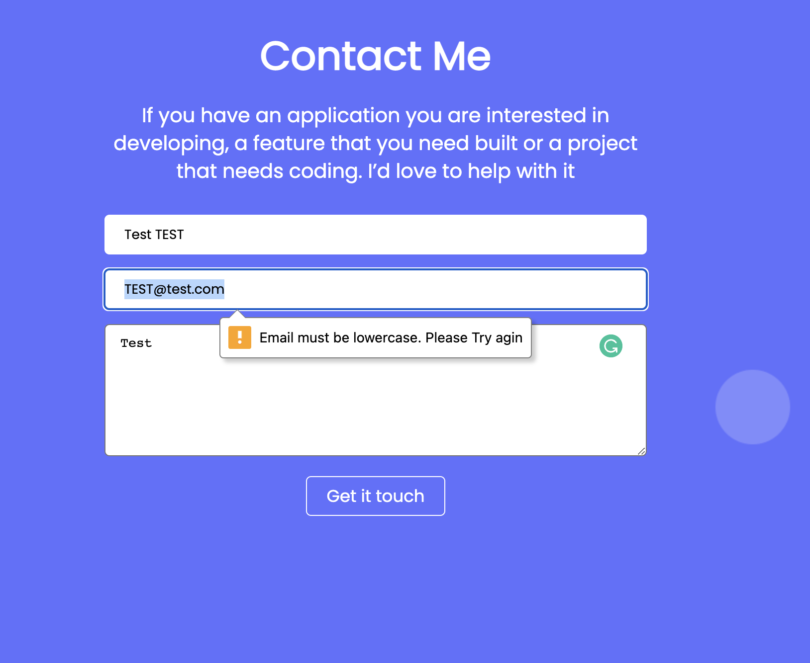

# Portfolio

- Mobile Version Skeleton  shows mobile skeleton version of my portfolio.
- Desktop Version ```@media (min-width: 768px)``` shows desktop version of portfolio 
- I have used flexbox grid  to align items.
-I have used background svg image and colour to customise.
- All the social media icons leads to my real profiles. 
- Nav bar has loading Animation.
- Work section card has hover scale animation.
- conatct form button has animaton. 
- Completed Portfolio web page deployed with github page. 
- When the user clicks the hamburger button, the mobile menu appears.
- When the user clicks the close (X) button, the mobile menu disappears.
- When the user clicks any of the mobile menu options, the mobile menu disappears.
- When the user clicks any of the mobile menu options, a correct part of the page is displayed.
- When the user submits the form,It checks if the email is in lower case.
- If the validation is OK, the form is sent.
- If the validation is not OK, It shows an error message to the user near the submit button      informing them of the error and the form is not sent.
- When the user changes the content of any input field, the data is saved to the local storage.
- When the user loads the page, if there is any data in the local storage the input fields are pre-filled with this data.

## Learning objectives
- Understand how to parse a Figma design to create a UI.
- Flexbox /Gridbox to place elements in the page.
- Build a personal portfolio site.
- Use images and backgrounds to enhance the look of the website.
- Use Animations to enhance the user experience and overall look of website. 
- Learn to deploy github repos using github  page.
- Learn DOM 
- Learn web storage API


## Built With

- HTML
- CSS
- Javascript

## Prerequisites
- Setup Git and Github
- Install Npm and Linters

# Project preview
Live Demo of the project :- [Portfolio](https://krishnabot.github.io/Portfolio/)








## Author

👤 **Krishna**

- GitHub: [@Krishnabot](https://github.com/Krishnabot)
- Twitter: [@last_matrix](https://twitter.com/last_matrix)
- LinkedIn: [LinkedIn](https://www.linkedin.com/in/krishna-prasad-acharya-3596bb130/)

**Collaboration Partner**


## 🤝 Contributing

Contributions, issues, and feature requests are welcome!

Feel free to check the [issues page](../../issues/).

## Show your support

Give a ⭐️ if you like this project!

## Acknowledgments

- Figma Template [Figma template](https://www.figma.com/file/l7SqJ3ZfkAKih9sFxvWSR4/Microverse-Student-Project-1?node-id=34%3A848)
- MDN Documentation [mdn web docs](https://developer.mozilla.org/en-US/docs/Web/CSS/transform-function)

## 📝 License

This project is [MIT](./MIT.md) licensed.
